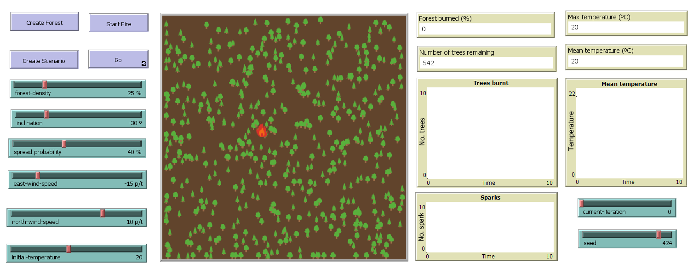

# Forest-Fire-NetLogo

NetLogo project for modeling the spread of a forest fire.

## Description

This project was developed for the course of Natural Computation at the University of Trás-os-Montes and Alto Douro. The goal of the project was to model the spread of a forest fire in a forest, using the NetLogo programming language.

## Model

The model is based on the following assumptions:

* The forest is a square of 33x33 cells.
* There are two kinds of forest trees: pine and oak.
* Each tree has a probability of being ignited by the fire.
* Each tree has a probability of creating sparks, which can ignite other trees.
* The fire spreads to the adjacent cells, with a probability of being ignited.
* The wind can blow the fire in a certain direction, with a certain inclination.

The model provides a graphical interface, where the user can see the forest, the fire, and the wind. The user can also change the parameters of the model, and run the simulation. See the following image for a graphical representation of the model.

## Model Parameters

The model has the following parameters:

* `forest-density` - The density of the forest.
* `inclination` - The inclination of the terrain.
* `east-wind-speed` - The speed of the wind in the east direction (negative if the wind blows to the west).
* `north-wind-speed` - The speed of the wind in the north direction (negative if the wind blows to the south).
* `initial-temperature` - The initial temperature for every patch of the world.
* `spark-frequency` - The frequency of the sparks in ticks.
* `spread-probability` - The probability of a tree being ignited by the fire.
* `seed` - The seed for the random number generator.
* `current-run` - The number of the current run.
* `iterations` - list of entries containing a snapshot of the model at the end of each iteration.

## Model Variables

Both the world and the trees have variables. Each patch of the world has the following parameters:

* `temperature` - The temperature of the patch.
* `altitude` - The altitude of the patch.

Every tree, according to its type, has the following parameters:

* `kind` - The kind of the tree.
* `burning-speed` - The speed at which the tree burns.
* `spark-probability` - The probability of the tree creating sparks.
* `is-burning` - Whether the tree is burning or not.
* `is-burnt` - Whether the tree is burnt or not.
* `ticks-since-spark` - The number of ticks since the last spark.

## Runs

The model was run to simulate the spread of a fire in a forest. There are 4 scenarios, each one with a different wind direction and inclination. The results are shown in the following table.

Each scenario was run 11 times, with the same initial conditions, and the results are shown in the following table.

| Scenario | Wind       | Inclination | Conditions |
|----------|------------|-------------|------------|
| 1        | South-east | 30º         | In Favor   |
| 2        | South-east | -30º        | Against    |
| 3        | North-west | 30º         | Against    |
| 4        | North-west | -30º        | In Favor   |